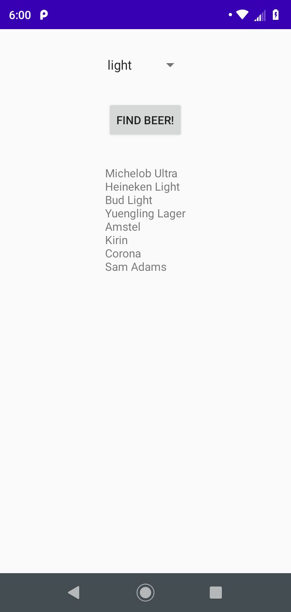

# Beer Advisor
## An Introduction: Android App 

## 1. Version Control: 

`
Version Control with Android Studio is fairly straight forward. Android Studio allows you to commit
and push content to GitHub (and others) with just a few quick clicks. There's a VCS option on the top
of Android Studio that gives many options, as well as a Version Control Log and Console.
`

## 2. AVD (Android Virtual Device) Manager

`
Android Studio also has an AVD Manager that allows you to set up a virtual Android device right on your screen.
It's pretty cool, but I found that it can be pretty slow. Luckily there are other options, mainly connecting your 
Android device to your computer through USB and running a simulation of your app on your phone. This allows you to
test your app and ensure things are the way you want them and it's much faster. 
`
## 3. Layouts, Activities, TextViews and Widgets

`
This app is fairly simple and allowed me to understand some basic concepts of Android Development. Let's 
take layouts as an example: In this project I used a Linear Layout for my main activity (here I only have 
one activity), but using a Linear layout allowed me to set up the layout screen (see images). This 
layout is set in a linear fashion, at the top of the screen I have a Spinner widget, in the middle I have a
button widget, and lastly a textView (which is used to display the type of beer). I know there are other 
layouts you can use, such as horizontal layouts which would place widgets to the right or left of each 
other. Android Studio does a lot of code generation for you when you set up a new project, and even allows 
you to use the Display software to drag and drop different components to your app; generating the XML for you.
This brings me to my next learning point. 

`
## 4. XML

`
I never truly used XML before, although I've seen it while viewing other developer's code. When I first created 
my project, Android studio generated tons of code and I quickly used drag and drop to add components, which generated
its own XML. I had no idea what it meant so I decided to learn a bit of XML on the fly to figure out how to really
build this simple layout. Every widget you use in a layout will have an 'id' (android:id=@+id/"idname") that acts as 
a reference to that widget. Amongst many things; you'll set the height, weight, gravity, text, and in some cases the 
activity (ex: onClick="onClickFindBeer") which is a reference to a method in the mainActivity.java file, to many of 
the widget components. Although drag and drop is a great way to boost productivity and lower the amount of time it
takes to complete projects, I recommend understanding the basics of XML. I almost forgot strings.xml. You can find this
file in the res directory in values. strings.xml is a XML file that allows you to store string resources. For example, 
in this app I used a text resource for the button widget that say's find beers. In the activity_main.xml file under the 
button widget xml source code there's an option that looks like this ( android:text="@string/find_beer"). You could 
write ( android:text="Find Beer") so it appears this way on the button widget, but let's say you use these same characters
for multiple button widgets and rather than using a string resource you instead type out android:text="find beer" on every
widget you create. You and your teammates decide you want the different buttons to say "cheers" rather than "find beer", so 
now you have to change every widget to say "cheers" which may take a long time. If you were to write a string resource in 
strings.xml you could make it so you use that resource with every botton widget you'd like to say "cheers". If your teammates
decide to change it again to "HappyHour" all you'd have to do is change the string resource in strings.xml to say happy hour and you're off to the next task. Even though this may appear to sound like nothing too significant, it really seems to boost productivity and allow for adaptability. 
`

